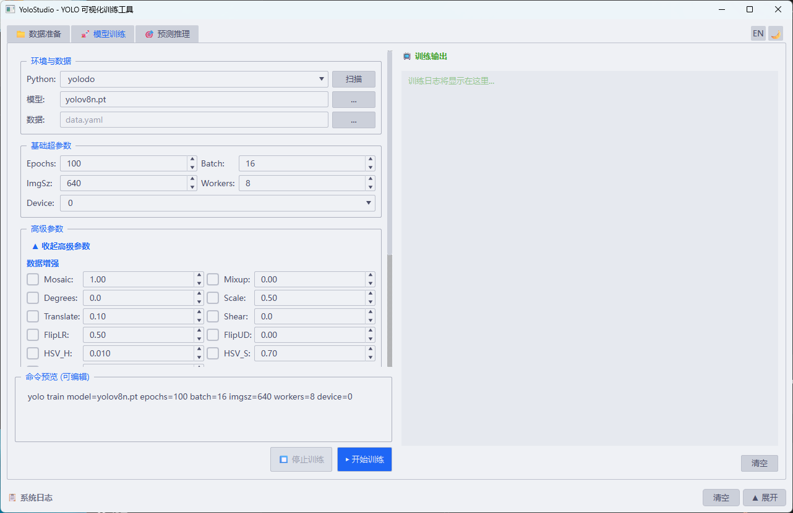
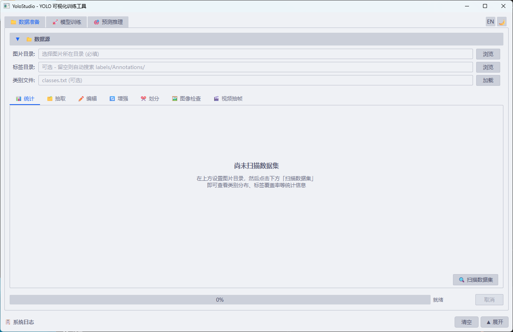
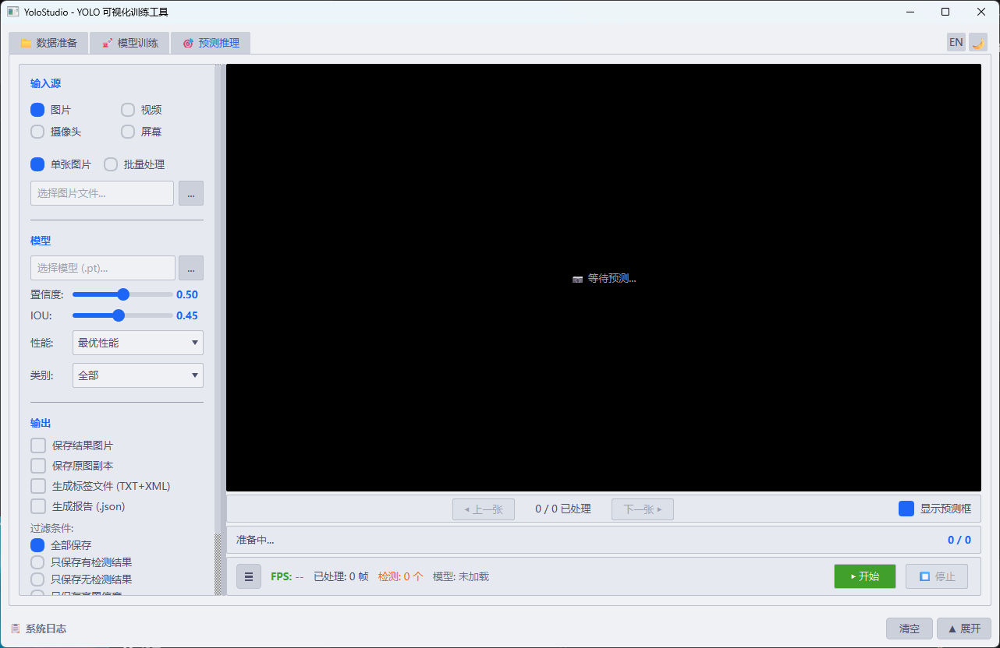

# YoloStudio

一个基于 **PySide6 + Ultralytics YOLO** 的桌面可视化工具，用来把数据准备、模型训练和预测推理放到同一个 GUI 工作流里。  
A **PySide6 + Ultralytics YOLO** desktop application that brings dataset preparation, model training, and visual inference into one GUI workflow.

> 当前仓库面向源码交付；模型权重、运行日志、推理输出、临时文件和本机配置默认不纳入版本管理。

## 界面预览 / Screenshots

### 模型训练 / Model Training

中文：在图形界面中配置训练环境、模型权重、数据集和关键超参数，并实时查看训练命令预览与日志输出。  
English: Configure the training environment, model weights, dataset, and key hyperparameters from the GUI, with live command preview and training logs.



### 数据准备 / Data Preparation

中文：集中完成数据目录选择、类别文件加载、统计分析、抽帧、增强、划分与图像检查，方便在训练前快速整理数据集。  
English: Prepare datasets in one place with folder selection, class loading, statistics, frame extraction, augmentation, splitting, and image inspection before training.



### 预测推理 / Prediction

中文：支持图片、视频、摄像头与屏幕等输入模式，可配置置信度、IOU、输出选项和批处理流程。  
English: Run inference on images, videos, camera feeds, or screen capture with configurable confidence, IOU, output options, and batch-processing workflows.



## 功能概览

### 1. 数据准备
- 数据集扫描与类别统计
- 标签批量编辑 / 替换 / 删除
- 数据集划分
- 格式转换
- 图像健康检查
- 视频抽帧
- 数据增强

### 2. 模型训练
- 图形界面配置 YOLO 训练参数
- 自动发现 Conda 环境
- 训练日志实时回显
- 训练过程与界面解耦，避免主线程卡死

### 3. 预测推理
- 支持图片、视频、摄像头、屏幕输入
- 支持关键帧、结果视频、报告输出
- 支持批量图片 / 批量视频处理
- 提供暗色 / 亮色主题切换

## 技术栈

- Python 3.10+
- PySide6
- Ultralytics
- PyTorch / TorchVision
- OpenCV

## 运行环境

当前代码与启动脚本更偏向 **Windows + Conda** 使用方式，但核心 Python 代码大多保持跨平台写法。

推荐环境：

- Python 3.10
- 已安装 Conda（可选但推荐）
- CUDA（可选，用于 GPU 推理/训练）

## 快速开始

### 1. 安装依赖

```bash
pip install -r requirements.txt
```

### 2. 启动程序

```bash
python main.py
```

## 测试

运行测试：

```bash
pytest tests -q
```

如果当前环境没有安装 `pytest`，先执行：

```bash
pip install pytest
```

当前仓库包含的测试主要覆盖：
- 数据处理关键逻辑
- 训练环境检测
- 视频批处理结果清单
- 原子写入与线程池清理

## 项目结构

```text
yolodo2.0/
├── main.py                 # 程序入口
├── config.py               # 全局配置
├── core/                   # 核心业务逻辑
├── ui/                     # PySide6 界面
├── utils/                  # 通用工具
├── resources/              # SVG 等静态资源
├── tests/                  # 自动化测试
├── docs/                   # 项目文档
└── requirements.txt
```

## 文档

- 使用手册：[`docs/USER_MANUAL.md`](docs/USER_MANUAL.md)
- 项目报告：[`docs/PROJECT_REPORT.md`](docs/PROJECT_REPORT.md)
- GitHub 推送整理清单：[`docs/GITHUB_PUBLISH_CHECKLIST.md`](docs/GITHUB_PUBLISH_CHECKLIST.md)

## 仓库发布说明

这个仓库默认 **不提交** 以下内容：

- 模型权重（如 `*.pt`、`*.onnx`）
- 训练 / 推理输出（如 `runs/`、`logs/`）
- 本机工具目录（如 `.codex/`、`.agent/`、`.gemini/`）
- 临时脚本与实验目录（如 `tmp/`、`scratch/`）
- 本机配置与密钥（如 `.env*`、`config.json`）

如果准备推送到 GitHub，请先看：

- [`docs/GITHUB_PUBLISH_CHECKLIST.md`](docs/GITHUB_PUBLISH_CHECKLIST.md)

## License

本仓库采用 GNU Affero General Public License v3.0（AGPL-3.0）许可。  
This repository is licensed under the GNU Affero General Public License v3.0 (AGPL-3.0).
