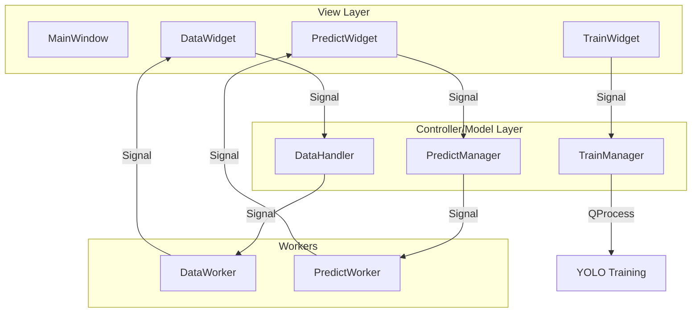
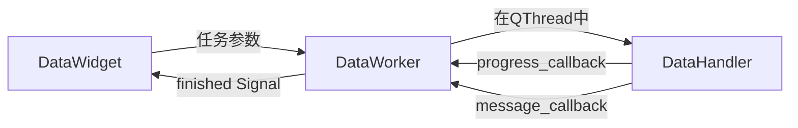
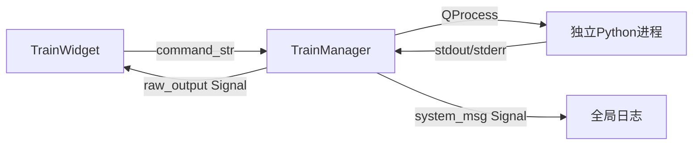
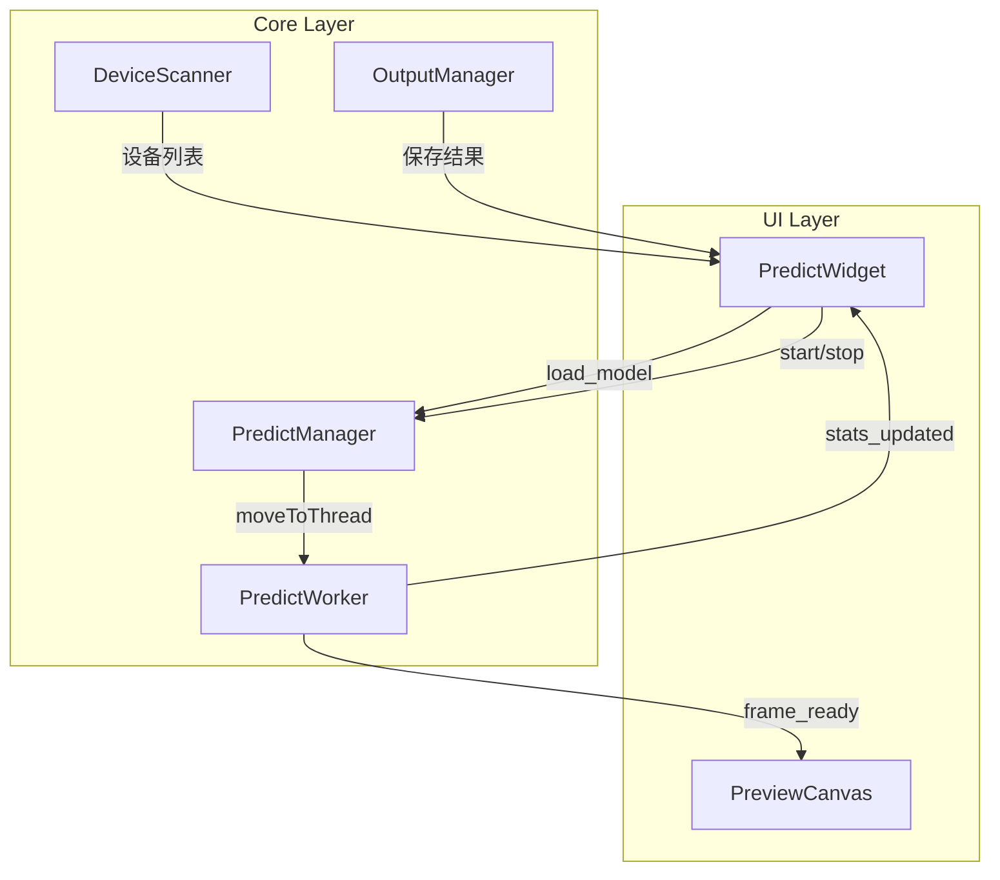

# YoloStudio 项目报告

## 项目基本信息

| 项目名称 | YoloStudio - YOLO 可视化训练工具 |
|---------|--------------------------------|
| 版本 | 2.0 |
| 开发周期 | 2026年1月 |
| 技术栈 | Python 3.10, PySide6, Ultralytics |
| 运行环境 | Windows, Conda |
| 代码规模 | 约 6000+ 行核心代码 |

---

## 1. 项目概述

### 1.1 项目背景

目标检测模型训练通常需要命令行操作，对于非专业用户存在较高的学习门槛。YoloStudio 旨在提供一个直观的图形界面，简化 YOLO 模型的数据准备、训练和推理流程。

**痛点分析：**
- 命令行参数繁多，容易出错
- 数据集格式转换需要编写脚本
- 训练过程缺乏可视化反馈
- 模型推理需要额外编码

### 1.2 项目目标

- ✅ 提供数据集可视化统计和管理功能
- ✅ 简化模型训练参数配置
- ✅ 支持多种输入源的实时推理
- ✅ 提供美观现代的用户界面
- ✅ 支持暗色/亮色主题切换

### 1.3 目标用户

| 用户类型 | 使用场景 |
|---------|---------|
| AI 初学者 | 快速上手目标检测训练 |
| 数据标注员 | 数据集管理和格式转换 |
| 算法工程师 | 模型调试和验证 |
| 产品经理 | 模型效果演示 |

---

## 2. 技术架构

### 2.1 目录结构

```
yolodo2.0/
├── main.py                     # 应用入口 (145行)
├── config.py                   # 配置管理 (180行)
│
├── core/                       # 核心逻辑层 (Model/Controller)
│   ├── data_handler.py         # 数据处理核心 (1421行)
│   ├── train_handler.py        # 训练进程管理 (307行)
│   ├── predict_handler.py      # 推理核心逻辑 (472行)
│   ├── camera_scanner.py       # 摄像头设备扫描
│   └── output_manager.py       # 输出文件管理
│
├── ui/                         # 视图层 (View)
│   ├── main_window.py          # 主窗口 + 日志面板
│   ├── base_ui.py              # QSS 主题样式
│   ├── data_widget.py          # 数据模块 UI (1233行)
│   ├── train_widget.py         # 训练模块 UI (761行)
│   ├── predict_widget.py       # 推理模块 UI (776行)
│   ├── focus_widgets.py        # 防误触控件集
│   └── predict_preview.py      # 预览画布
│
├── utils/                      # 工具类
│   └── logger.py               # 日志管理
│
├── resources/                  # 资源文件
│   ├── arrow_*.svg             # 下拉箭头图标
│   └── spinbox_*.svg           # SpinBox 箭头图标
│
└── docs/                       # 文档
    ├── USER_MANUAL.md          # 使用手册
    └── PROJECT_REPORT.md       # 项目报告
```

### 2.2 MVC 架构设计



### 2.3 核心技术栈

| 技术 | 版本 | 用途 |
|------|------|------|
| Python | 3.10+ | 运行时 |
| PySide6 | 6.x | GUI 框架 |
| Ultralytics | 8.x | YOLO 模型训练/推理 |
| OpenCV | 4.x | 图像/视频处理 |
| Pandas | 2.x | 数据分析 |
| PyYAML | 6.x | 配置文件解析 |
| mss | 9.x | 屏幕录制 (可选) |

### 2.4 设计原则

#### 2.4.1 MVC 分离
```
UI 层 (ui/)           只负责展示和用户交互
                       ↓ Signal
Core 层 (core/)       纯 Python 逻辑，不依赖 QtWidgets
                       ↓ Signal
Worker 层             QThread 中执行耗时操作
```

#### 2.4.2 信号槽通信
所有模块间通信均使用 Qt 信号槽机制，确保：
- 线程安全
- 松耦合
- 易于测试

#### 2.4.3 非阻塞原则
- 所有 > 100ms 的操作必须在 QThread 中执行
- 模型训练使用独立 QProcess（避免 GIL 锁定）
- 使用 `interrupt_check` 回调支持取消操作

---

## 3. 功能模块详解

### 3.1 数据准备模块 (`DataWidget` + `DataHandler`)

#### 3.1.1 模块架构



#### 3.1.2 核心数据结构

```python
@dataclass
class ScanResult:
    """数据集扫描结果"""
    total_images: int               # 图片总数
    labeled_images: int             # 有标签的图片数
    missing_labels: list[Path]      # 缺失标签的图片路径
    empty_labels: int               # 空标签数量
    class_stats: dict[str, int]     # 类别统计 {类名: 数量}
    classes: list[str]              # 类别列表
    label_format: LabelFormat       # 标签格式 (TXT/XML)

@dataclass
class SplitResult:
    """数据集划分结果"""
    train_path: str                 # 训练集路径
    val_path: str                   # 验证集路径
    train_count: int                # 训练集数量
    val_count: int                  # 验证集数量
```

#### 3.1.3 功能清单

| 功能 | 描述 | 实现方法 |
|------|------|---------|
| 数据集扫描 | 统计图片、标签、类别分布 | `scan_dataset()` |
| 空标签生成 | 为无标签图片生成空标签文件 | `generate_empty_labels()` |
| 标签批量编辑 | 替换/删除指定类别 | `modify_labels()` |
| 格式转换 | TXT ↔ XML 互转 | `convert_format()` |
| 数据集划分 | 按比例划分训练/验证集 | `split_dataset()` |
| 按类别分类 | 按标签类别分组数据 | `categorize_by_class()` |
| YAML 生成 | 生成 Ultralytics 配置文件 | `generate_yaml()` |

#### 3.1.4 智能路径检测

系统自动检测标签目录位置：
```
优先级 1: images/../labels/     (YOLO 标准结构)
优先级 2: images/../Annotations/ (Pascal VOC 结构)
优先级 3: 与图片同目录
```

#### 3.1.5 UI 布局

```
┌─────────────────────────────────────────────────────────┐
│ 路径配置区                                               │
│ ┌─────────────────────────────────┬───────────────────┐ │
│ │ 图片目录: [________________] │ [浏览] [扫描]      │ │
│ │ 标签目录: [________________] │ [浏览] [自动检测]   │ │
│ │ classes.txt: [_____________] │ [加载]             │ │
│ └─────────────────────────────────┴───────────────────┘ │
├─────────────────────────────────────────────────────────┤
│ [统计] [编辑] [划分] [YAML]                              │
├─────────────────────────────────────────────────────────┤
│ Tab 内容区                                               │
├─────────────────────────────────────────────────────────┤
│ 进度条 + 状态 + [取消]                                   │
└─────────────────────────────────────────────────────────┘
```

---

### 3.2 模型训练模块 (`TrainWidget` + `TrainManager`)

#### 3.2.1 模块架构



#### 3.2.2 Conda 环境检测

**检测方法：**
```python
# 方法 A (主要): 使用 conda env list
subprocess.run(["conda", "env", "list", "--json"])

# 方法 B (回退): 扫描常见目录
- ~/anaconda3/envs/
- ~/miniconda3/envs/
- <conda-install-dir>/envs/
```

**显示格式：**
```
环境名称 (python.exe 路径)
例: sample-env (<env-root>/python.exe)
```

#### 3.2.3 训练参数

**基础参数：**
| 参数 | 默认值 | 描述 |
|------|--------|------|
| model | yolov8n.pt | 预训练模型 |
| data | - | 数据集配置文件 |
| epochs | 100 | 训练轮数 |
| imgsz | 640 | 输入图片尺寸 |
| batch | 16 | 批次大小 |
| workers | 8 | 数据加载线程数 |
| device | 0 | GPU 设备 ID |

**高级参数 (可折叠)：**
| 参数 | 默认值 | 描述 |
|------|--------|------|
| lr0 | 0.01 | 初始学习率 |
| lrf | 0.01 | 最终学习率比例 |
| momentum | 0.937 | 动量 |
| weight_decay | 0.0005 | 权重衰减 |
| warmup_epochs | 3.0 | 预热轮数 |
| patience | 50 | 早停耐心值 |
| optimizer | SGD | 优化器类型 |
| close_mosaic | 10 | 关闭马赛克增强的轮数 |
| amp | True | 自动混合精度 |

#### 3.2.4 命令生成与编辑

系统自动生成训练命令，用户可手动编辑：
```bash
yolo detect train model=yolov8n.pt data=data.yaml epochs=100 imgsz=640 batch=16 device=0
```

#### 3.2.5 进程管理

```python
class TrainManager(QObject):
    # 信号定义
    raw_output = Signal(str)        # 原始输出 → 终端
    system_msg = Signal(str, str)   # 系统消息 → 全局日志
    training_finished = Signal()    # 训练结束
    
    def start_training(self, command_str: str, work_dir: str) -> bool:
        """启动训练进程"""
        
    def stop_training(self):
        """停止训练进程 (发送 SIGTERM)"""
```

---

### 3.3 预测推理模块 (`PredictWidget` + `PredictManager`)

#### 3.3.1 模块架构



#### 3.3.2 输入源类型

```python
class InputSourceType(Enum):
    IMAGE = "image"      # 单张图片
    VIDEO = "video"      # 视频文件
    CAMERA = "camera"    # 摄像头
    SCREEN = "screen"    # 屏幕录制
    RTSP = "rtsp"        # RTSP 流
```

#### 3.3.3 推理参数

| 参数 | 范围 | 描述 |
|------|------|------|
| confidence | 0.0-1.0 | 置信度阈值 |
| IOU | 0.0-1.0 | NMS IOU 阈值 |
| 高置信度过滤 | 开/关 | 只显示高于阈值的检测 |

#### 3.3.4 PredictWorker 工作流程

```python
def run(self):
    """推理主循环"""
    if self._source_type == InputSourceType.IMAGE:
        self._process_image()
    elif self._source_type == InputSourceType.SCREEN:
        self._process_screen()
    else:
        self._process_video_stream()

def _run_inference(self, frame, conf, iou):
    """执行单帧推理"""
    results = self._model(frame, conf=conf, iou=iou, verbose=False)
    annotated = results[0].plot()
    detections = self._parse_detections(results[0])
    return annotated, detections
```

#### 3.3.5 设备扫描

```python
class DeviceScanner:
    """摄像头和屏幕设备扫描器"""
    
    def scan_cameras(self) -> list[tuple[int, str]]:
        """扫描可用摄像头"""
        # 返回: [(device_id, device_name), ...]
        
    def scan_screens(self) -> list[dict]:
        """扫描可用显示器"""
        # 返回: [{"id": 0, "width": 1920, "height": 1080}, ...]
```

#### 3.3.6 UI 布局

```
┌──────────────────────────────────────────────────────────────┐
│ [◀] 配置面板                          预览区域               │
│ ┌────────────────┐  ┌────────────────────────────────────┐  │
│ │ ▼ 输入源       │  │                                    │  │
│ │ ○图片 ○视频    │  │                                    │  │
│ │ ○摄像头 ○屏幕  │  │         PreviewCanvas              │  │
│ │ [____________] │  │                                    │  │
│ │────────────────│  │                                    │  │
│ │ ▼ 模型配置     │  │                                    │  │
│ │ 模型: [浏览]   │  │                                    │  │
│ │ 置信度: ===○   │  │                                    │  │
│ │ IOU: ===○      │  │                                    │  │
│ │────────────────│  └────────────────────────────────────┘  │
│ │ ▼ 输出设置     │  ┌────────────────────────────────────┐  │
│ │ 输出目录       │  │ FPS: 30 | 检测: 5 | 已保存: 10     │  │
│ │ □ 自动保存     │  │ [▶ 开始]  [⏹ 停止]  [📷 截图]     │  │
│ └────────────────┘  └────────────────────────────────────┘  │
└──────────────────────────────────────────────────────────────┘
```

---

## 4. UI/UX 设计

### 4.1 主题系统

#### 4.1.1 配色方案 (Catppuccin)

**暗色主题：**
| 变量 | 颜色值 | 用途 |
|------|--------|------|
| base | #1e1e2e | 背景 |
| surface0 | #313244 | 控件背景 |
| text | #cdd6f4 | 文字 |
| blue | #89b4fa | 强调色 |
| red | #f38ba8 | 错误/删除 |
| green | #a6e3a1 | 成功 |

**亮色主题：**
| 变量 | 颜色值 | 用途 |
|------|--------|------|
| base | #eff1f5 | 背景 |
| surface0 | #ccd0da | 控件背景 |
| text | #4c4f69 | 文字 |
| blue | #1e66f5 | 强调色 |

#### 4.1.2 主题切换

```python
# 主窗口 Tab 栏右侧的主题切换按钮
def _toggle_theme(self):
    current = self.config.get("theme", "dark")
    new_theme = "light" if current == "dark" else "dark"
    self.config.set("theme", new_theme)
    self._apply_theme(new_theme)
```

### 4.2 控件优化

#### 4.2.1 QSpinBox 样式

```css
/* 垂直箭头布局 */
QSpinBox::up-button {
    subcontrol-position: top right;
    width: 16px;
    height: 12px;
    border-radius: 3px 3px 0 0;
}

QSpinBox::down-button {
    subcontrol-position: bottom right;
    width: 16px;
    height: 12px;
    border-radius: 0 0 3px 3px;
}
```

#### 4.2.2 QComboBox 样式

```css
/* 三角形下拉箭头 */
QComboBox::drop-down {
    border: none;
    width: 24px;
}

QComboBox::down-arrow {
    image: url(resources/arrow_down_dark.svg);
    width: 10px;
    height: 10px;
}
```

#### 4.2.3 QSlider 样式

```css
/* 圆形滑块 + 蓝色轨道 */
QSlider::groove:horizontal {
    height: 6px;
    background: #45475a;
    border-radius: 3px;
}

QSlider::handle:horizontal {
    width: 16px;
    height: 16px;
    margin: -5px 0;
    background: #89b4fa;
    border-radius: 8px;
}
```

### 4.3 防误触设计

自定义控件系列，只有获得焦点后才响应滚轮事件：

```python
class FocusSpinBox(QSpinBox):
    """防误触 SpinBox"""
    
    def wheelEvent(self, event):
        if self.hasFocus():
            super().wheelEvent(event)
        else:
            event.ignore()  # 传递给父容器滚动
```

**防误触控件列表：**
- `FocusSpinBox` - 整数输入框
- `FocusDoubleSpinBox` - 浮点数输入框
- `FocusSlider` - 滑块
- `FocusComboBox` - 下拉框

### 4.4 窗口行为

| 行为 | 描述 |
|------|------|
| 启动位置 | 屏幕居中 |
| 默认尺寸 | 1280 × 800 |
| 日志面板 | 展开时占 15% 高度 |
| 配置面板 | 可折叠隐藏 |

---

## 5. 信号与槽定义

### 5.1 DataHandler 信号

```python
class DataWorker(QThread):
    progress = Signal(int, int)      # (当前, 总数)
    message = Signal(str)            # 日志消息
    scan_finished = Signal(object)   # ScanResult
    split_finished = Signal(object)  # SplitResult
    generate_finished = Signal(int)  # 生成数量
    modify_finished = Signal(int)    # 修改数量
    error = Signal(str)              # 错误消息
```

### 5.2 TrainManager 信号

```python
class TrainManager(QObject):
    raw_output = Signal(str)         # 原始输出
    system_msg = Signal(str, str)    # (消息, 级别)
    training_finished = Signal()     # 训练完成
```

### 5.3 PredictManager 信号

```python
class PredictManager(QObject):
    frame_ready = Signal(object, list)   # (帧, 检测结果)
    stats_updated = Signal(dict)         # 统计数据
    error = Signal(str)                  # 错误
    finished = Signal()                  # 完成
```

---

## 6. 配置管理

### 6.1 配置文件位置

```
~/.yolostudio/config.json
```

### 6.2 配置项

```yaml
# 主题设置
theme: "dark"  # dark | light

# 最近使用的路径
recent_paths:
  image_dir: "<dataset_root>/images"
  label_dir: "<dataset_root>/labels"
  model_path: "<model_dir>/best.pt"
  output_dir: "<output_dir>"

# 训练默认参数
train_defaults:
  epochs: 100
  imgsz: 640
  batch: 16

# 推理默认参数
predict_defaults:
  confidence: 0.5
  iou: 0.45
```

---

## 7. 开发记录

### 7.1 主要功能迭代

| 日期 | 功能 | 备注 |
|------|------|------|
| 2026-01-12 | 数据集划分功能 | 支持移动/复制/索引模式 |
| 2026-01-13 | 全局日志面板 | 百分比布局 |
| 2026-01-14 | 预测推理模块 | 多输入源支持 |
| 2026-01-21 | 主题切换 | 暗色/亮色 |
| 2026-01-21 | 窗口居中 | 启动时居中显示 |
| 2026-01-21 | 唯一目录名 | 防止覆盖已有文件夹 |
| 2026-01-21 | 按类别分类 | 数据集分组功能 |
| 2026-01-22 | 防误触控件 | FocusWidget 系列 |
| 2026-01-22 | SpinBox 样式 | 垂直箭头布局 |
| 2026-01-22 | UI 国际化 | 中英文切换准备 |

### 7.2 修复的问题

| 问题 | 原因 | 解决方案 |
|------|------|---------|
| 黑色方块 | 按钮硬编码背景色 | 使用 QSS 主题 |
| 内容溢出 | 缺少滚动容器 | 添加 QScrollArea |
| 滚轮误触 | 默认响应滚轮 | FocusWidget |
| SpinBox 箭头 | Qt 默认左右布局 | 自定义 QSS |
| QFont 警告 | CSS font-size 无效 | 使用 QFont API |
| 类别名错误 | 使用 ID 而非名称 | 加载 classes.txt |

---

## 8. 文件清单

### 8.1 核心代码文件

| 文件 | 行数 | 职责 |
|------|------|------|
| main.py | ~145 | 应用入口，初始化 |
| config.py | ~180 | 配置文件管理 |
| core/data_handler.py | ~1421 | 数据处理核心 |
| core/train_handler.py | ~307 | 训练进程管理 |
| core/predict_handler.py | ~472 | 推理核心逻辑 |
| core/camera_scanner.py | ~100 | 设备扫描 |
| core/output_manager.py | ~150 | 输出管理 |
| ui/main_window.py | ~400 | 主窗口 |
| ui/base_ui.py | ~300 | QSS 主题 |
| ui/data_widget.py | ~1233 | 数据模块 UI |
| ui/train_widget.py | ~761 | 训练模块 UI |
| ui/predict_widget.py | ~776 | 推理模块 UI |
| ui/focus_widgets.py | ~80 | 防误触控件 |
| ui/predict_preview.py | ~200 | 预览画布 |

### 8.2 资源文件

```
resources/
├── arrow_down_dark.svg   # 暗色下拉箭头
├── arrow_down_light.svg  # 亮色下拉箭头
├── spinbox_up_dark.svg   # 暗色上箭头
├── spinbox_up_light.svg  # 亮色上箭头
├── spinbox_down_dark.svg # 暗色下箭头
└── spinbox_down_light.svg # 亮色下箭头
```

### 8.3 文档文件

```
docs/
├── USER_MANUAL.md        # 用户使用手册
└── PROJECT_REPORT.md     # 项目技术报告
```

---

## 9. 后续规划

### 9.1 待优化项

- [ ] 训练进度可视化（损失曲线图表）
- [ ] 多 GPU 训练支持
- [ ] 模型对比功能
- [ ] 数据增强可视化预览
- [ ] 批量推理导出
- [ ] 模型量化与导出 (ONNX/TensorRT)

### 9.2 已知限制

| 限制 | 原因 | 备选方案 |
|------|------|---------|
| 训练必须独立进程 | 避免 GIL 锁定 GUI | 使用 QProcess |
| 摄像头兼容性 | OpenCV 后端限制 | 尝试不同后端 |
| 大数据集扫描慢 | 文件 I/O 密集 | 增量扫描 |
| 无实时损失曲线 | 解析训练输出复杂 | 后续版本 |

---

## 10. 总结

YoloStudio 2.0 成功实现了 YOLO 目标检测的可视化工作流程，提供了：

1. **完整的数据管理功能**：扫描、统计、编辑、划分、格式转换
2. **灵活的训练配置**：基础/高级参数分离，命令可编辑
3. **多源实时推理**：图片、视频、摄像头、屏幕、RTSP
4. **美观现代的界面**：暗色/亮色主题，防误触设计

通过 MVC 架构设计和信号槽通信机制，代码结构清晰、易于维护和扩展。项目总计约 **6000+ 行**核心代码，涵盖数据处理、模型训练、推理预测三大模块。

---

*报告日期: 2026-01-23*
*版本: 2.0*
